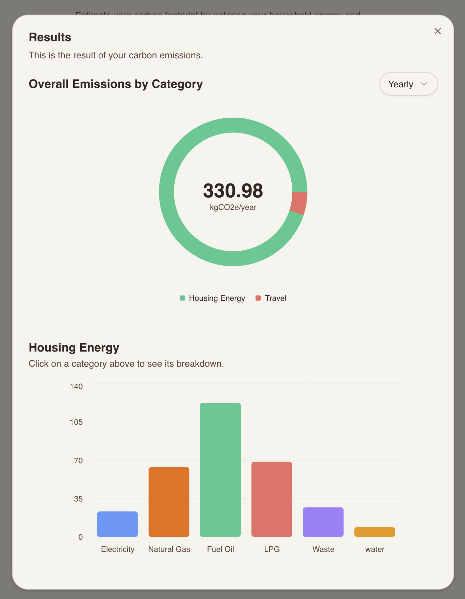

## Carbon Footprint Calculator

A simple carbon footprint calculator. It collects home energy and transportation usage, converts inputs using emission factors, and presents totals and breakdowns.

<p align="center">
  
</p>

### Quick start

```bash
pnpm install
pnpm dev
pnpm test     # unit and integration tests
pnpm test:e2e # e2e with Playwright
```

### App Architecture

- **Framework**: [Next.js App Router](https://nextjs.org)
- **API**: [tRPC](https://trpc.io)
- **UI**: [Shadcn](https://ui.shadcn.com)
- **Tests**: [Vitest](https://vitest.dev), [Playwright](https://playwright.dev)

---

## Project structure overview

```text
src/
  app/                     # Frontend (Next.js App Router)
  components/
    ui/                    # Shadcn UI primitives
    footprint-calculator/  # UI components
  trpc/                    # tRPC server/router (API)

tests/                     # e2e tests
```
